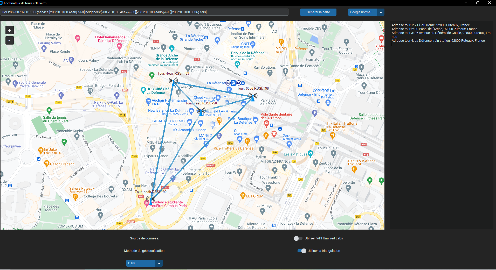
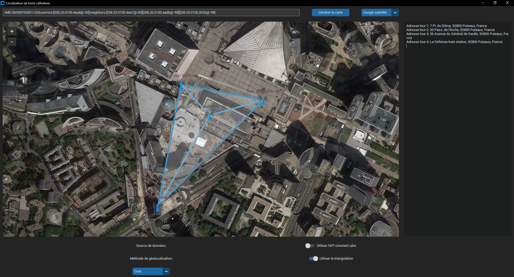
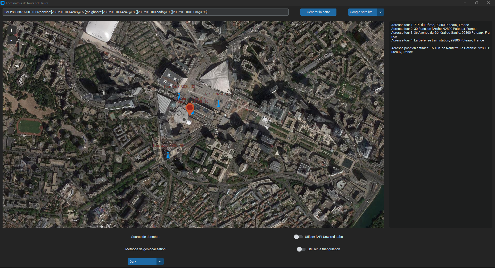

# Localisateur de tours cellulaires

Ce projet est une application qui utilise les données des tours cellulaires pour estimer la position d'un appareil mobile.

## Table des matières

- [Fonctionnalités](#fonctionnalités)
- [À propos du fichier CSV](#à-propos-du-fichier-csv)
- [Installation](#installation)
- [Usage](#usage)
- [Licence](#licence)

## Fonctionnalités

- **Géolocalisation basée sur les données des tours cellulaires** : Utilise les données des tours cellulaires pour trianguler ou estimer la position d'un appareil mobile.
- **Affichage de la position estimée sur une carte** : La position estimée est affichée sur une carte interactive, permettant un aperçu visuel de la localisation.
- 

- **Support pour Google Maps et OpenStreetMap** : Possibilité de choisir entre différents fournisseurs de cartes, notamment Google Maps (normal et satellite) et OpenStreetMap.
- 
  
  
- **Choix de la méthode de géolocalisation** :
    - **Triangulation** : Si cette option est activée, l'application utilisera la triangulation basée sur les données de trois tours ou plus pour estimer la position.
    - **Estimation basée sur la moyenne ** : Si la triangulation n'est pas utilisée, l'application estime la position en se basant sur les données de latitude et longitude.
      
      

- **Choix de la source de données** :
    - **CSV local** : Utilise un fichier CSV local contenant des données sur les tours cellulaires pour la géolocalisation. Le fichier CSV doit être placé dans le répertoire du projet.
    - **API Unwired Labs** : Utilise l'API Unwired Labs pour obtenir des données sur les tours cellulaires.

## À propos du fichier CSV

Le fichier CSV inclus n'est pas complet en raison de sa grande taille. Pour utiliser l'option de géolocalisation basée sur un fichier CSV, veuillez télécharger le fichier complet depuis le site de [OpenCellID](https://opencellid.org/) et le placer dans le répertoire de votre projet.

## Installation

pip install -r requirements.txt

## Usage

Exécutez `main.py` pour lancer l'application.

## Licence

Ce projet est sous licence MIT. Voir le fichier [LICENCE](LICENCE) pour plus de détails.

